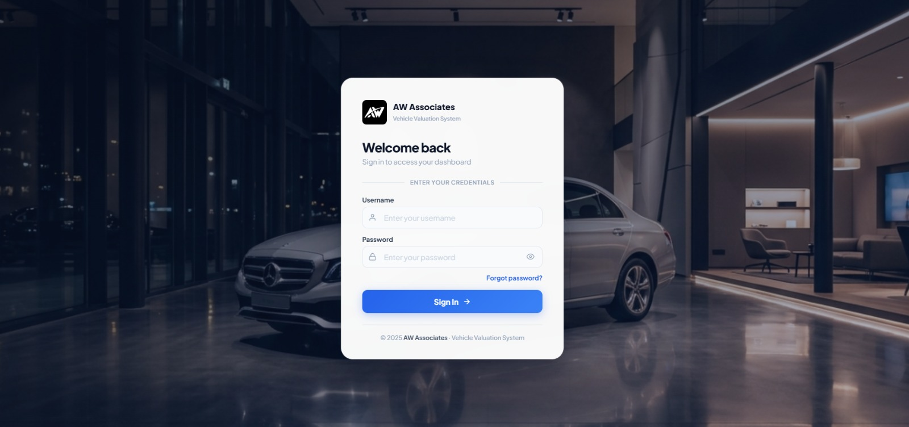
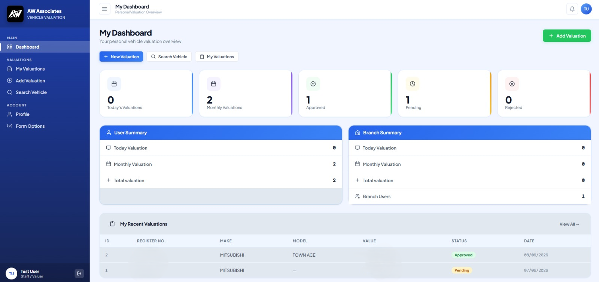
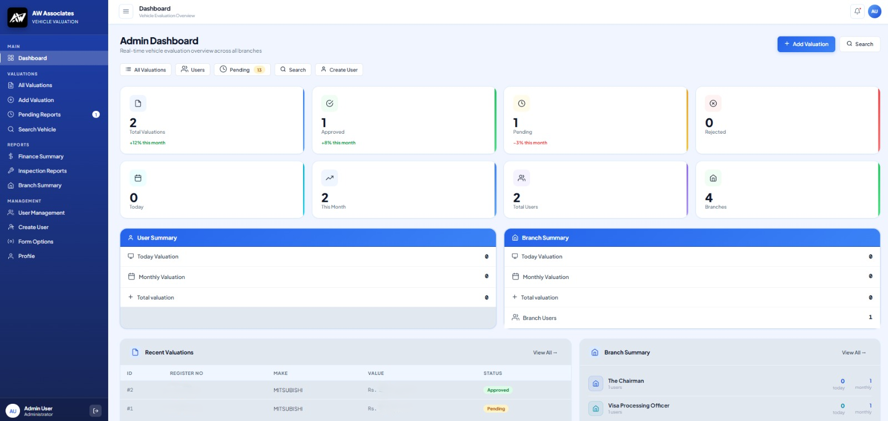
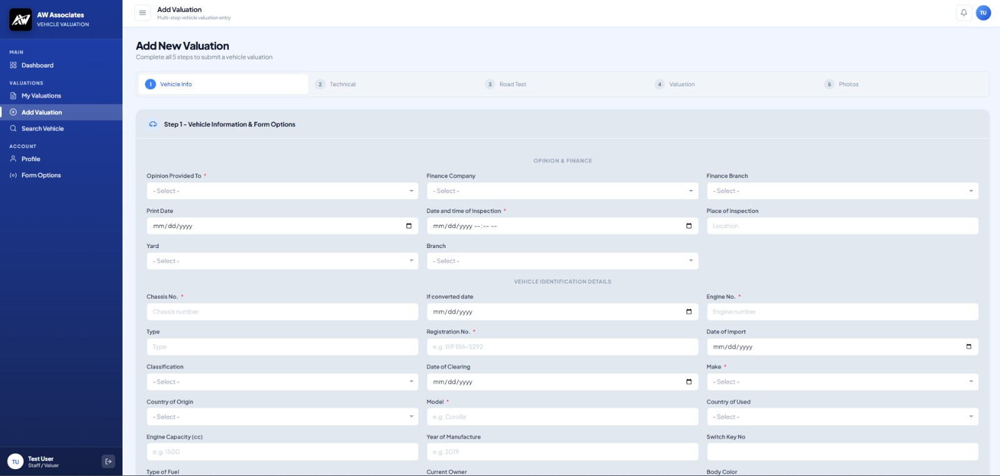
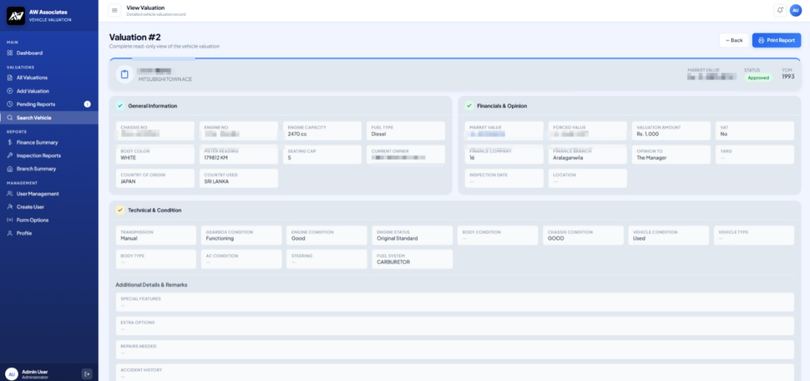
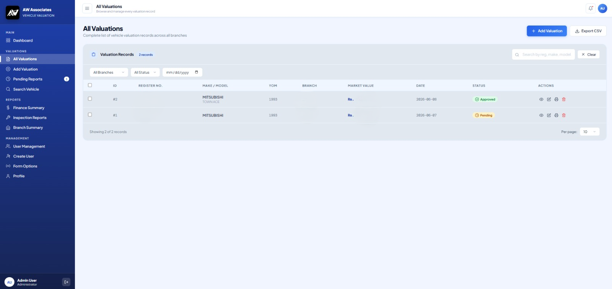
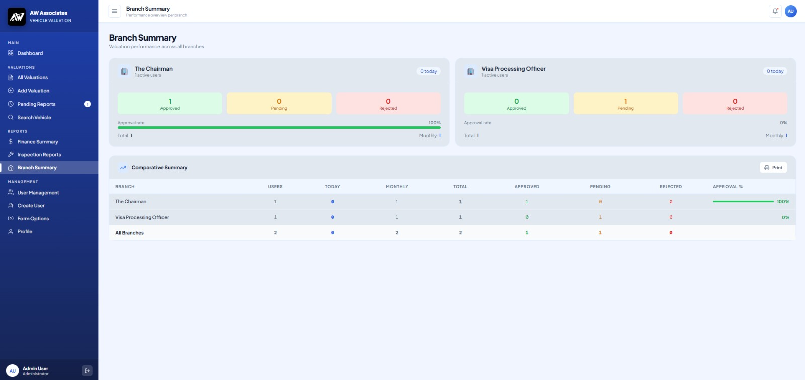
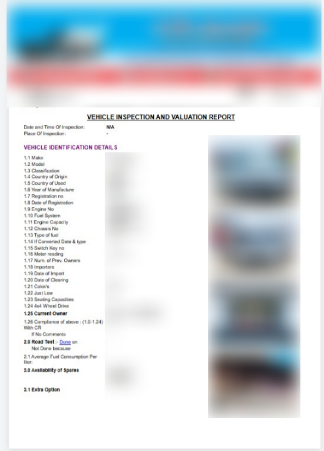

# Vehicle Valuation Management System

<p align="center">
  
</p>

<p align="center">
  A full-stack, multi-branch vehicle evaluation platform built for the Sri Lankan finance &amp; leasing industry.
</p>

<p align="center">
  
  
  
  
</p>

---

## 📋 Table of Contents

* [Overview](#overview)
* [Features](#features)
* [Tech Stack](#tech-stack)
* [Project Structure](#project-structure)
* [Getting Started](#getting-started)
  - [Prerequisites](#prerequisites)
  - [Backend Setup](#backend-setup)
  - [Frontend Setup](#frontend-setup)
* [Environment Variables](#environment-variables)
* [API Reference](#api-reference)
* [Pages & Roles](#pages--roles)
* [Demo Mode](#demo-mode)
* [Screenshots](#screenshots)
* [Deployment](#deployment)

---

## Overview

**Vehicle Valuation Management System** is a purpose-built internal tool for managing the complete lifecycle of vehicle valuations across multiple branches. The system supports two roles -**Admin** and **Staff (Data Entry)** -with a full workflow from submission through review to approval or rejection.

It replaces paper-based valuation processes with a digital platform featuring real-time dashboards, printable A4 PDF reports, image uploads, and database-driven form options.

---

## Features

### 🗂️ Valuation Management
* **100+ field** multi-step valuation form covering vehicle specs, technical evaluation, body condition, accessories, and valuation figures
* Create, edit, view, approve, and reject valuations
* Upload up to **5 vehicle photos** per valuation
* Print-ready **A4 PDF valuation reports** with professional layout, logo, signature blocks, and values written in words

### 👤 Role-Based Access
| Feature | Admin | Staff |
|---|:---:|:---:|
| All Valuations | ✅ | Own only |
| Approve / Reject | ✅ | ❌ |
| User Management | ✅ | ❌ |
| Form Options CRUD | ✅ | View only |
| Branch Reports | ✅ | ❌ |
| Finance Reports | ✅ | ❌ |

### 📊 Reports & Analytics
* **Admin Dashboard** -live cross-branch stats: total, approved, pending, rejected, today, monthly
* **Branch Summary Report** -per-branch breakdown with user count, today's submissions, monthly volume, approval rates
* **Finance Summary Report** -per-inspector fees, VAT breakdown, re-inspection (RER) tracking
* **Inspection Reports** -inspector-level performance

### ⚙️ Dynamic Form Options
* All dropdown values (makes, fuel types, body colors, finance companies, branches, inspectors, conditions) are stored in the database
* Admin manages them from the **Form Options** page -add, edit, delete in real time
* Finance companies support a **value/label pattern**: internal numeric ID stored in DB, human-readable name shown in UI and reports

### 🔍 Search
* Full-text vehicle search by registration number, make, model, chassis number, engine number

---

## Tech Stack

### Frontend
| Technology | Purpose |
|---|---|
| **Astro 6** (SSR, Node adapter) | Server-side rendered frontend framework |
| **Vanilla CSS** | Custom design system with CSS variables and tokens |
| **Choices.js** | Enhanced searchable dropdown components |
| **CropperJS** | In-browser image cropping before upload |
| **number-to-words** | Convert numeric valuation figures to words for reports |
| **Google Fonts** (Plus Jakarta Sans) | Typography |

### Backend
| Technology | Purpose |
|---|---|
| **Go (Golang)** | REST API -zero external web frameworks, pure `net/http` |
| **SQLite** (`modernc.org/sqlite`) | Embedded relational database |
| **JWT** | Stateless token-based authentication |
| **CORS middleware** | Secure cross-origin communication |
| **Static file server** | Serve uploaded vehicle images |

### Architecture
```
Browser
  │
  ├── GET /page  →  Astro SSR (port 4321)  ─── Static assets, layouts, pages
  │
  └── fetch()    →  Go REST API (port 8080) ─── Auth, CRUD, Stats, Options
                          │
                          └── SQLite
```

---

## Project Structure

```
aw-dashboard/
├── backend/                  # Go REST API
│   ├── main.go               # Entry point, route registration
│   ├── handlers/             # HTTP handler functions
│   ├── middleware/           # Auth (JWT), AdminOnly, CORS
│   ├── models/               # Data models / structs
│   ├── db/                   # Database connection & queries
│   └── migration.sql         # Database schema
│
├── src/
│   ├── layouts/
│   │   ├── DashboardLayout.astro   # Sidebar, topbar, auth guard
│   │   └── ReportLayout.astro      # Print-only A4 layout
│   │
│   ├── components/
│   │   ├── HeaderBanner.astro      # Report header with logo
│   │   ├── VehicleDetails.astro    # Vehicle info section for reports
│   │   ├── TechnicalEvaluation.astro
│   │   └── SignatureBlock.astro    # Report signature + values
│   │
│   ├── pages/
│   │   ├── index.astro             # Login page
│   │   │
│   │   ├── admin/                  # Admin-only pages
│   │   │   ├── dashboard.astro
│   │   │   ├── valuations.astro
│   │   │   ├── add-valuation.astro
│   │   │   ├── view-valuation.astro
│   │   │   ├── pending.astro
│   │   │   ├── search.astro
│   │   │   ├── users.astro
│   │   │   ├── create-user.astro
│   │   │   ├── form-options.astro
│   │   │   ├── profile.astro
│   │   │   └── reports/
│   │   │       ├── branch.astro
│   │   │       ├── finance.astro
│   │   │       └── inspection.astro
│   │   │
│   │   ├── user/                   # Staff pages
│   │   │   ├── dashboard.astro
│   │   │   ├── valuations.astro
│   │   │   ├── add-valuation.astro
│   │   │   ├── view-valuation.astro
│   │   │   ├── search.astro
│   │   │   ├── form-options.astro
│   │   │   └── profile.astro
│   │   │
│   │   └── reports/
│   │       └── [id].astro          # SSR printable PDF report page
│   │
│   └── styles/
│       └── global.css              # Full design system & component styles
│
├── public/                   # Static assets (Logo, login hero image, icons)
├── uploads/                  # Vehicle image uploads (served by Go)
├── astro.config.mjs
└── package.json
```

---

## Getting Started

### Prerequisites

* **Node.js** ≥ 22.12.0
* **Go** ≥ 1.25

---

### Backend Setup

```bash
# 1. Navigate to the backend directory
cd "e:/AW Associate/aw-dashboard/backend"

# 2. Copy environment variables
cp .env.example .env
# Edit .env with your JWT secret

# 3. Apply the SQLite schema (first run only)
# The backend auto-creates tables on startup via migration.sql

# 4. (Optional) Seed form options
# See seed_form_options.go in the root directory

# 5. Start the API server
go run main.go
# Server starts on http://localhost:8080
```

---

### Frontend Setup

```bash
# 1. Navigate to the project root
cd "e:/AW Associate/aw-dashboard"

# 2. Install dependencies
npm install

# 3. Start the dev server
npm run dev
# App starts on http://localhost:4321

# 4. Build for production
npm run build
```

---

## Environment Variables

Create a `.env` file in the `backend/` directory:

```env
# JWT
JWT_SECRET=your_super_secret_key

# Server
PORT=8080
```

---

## API Reference

All protected routes require the header: `Authorization: Bearer <token>`

| Method | Endpoint | Auth | Description |
|---|---|---|---|
| `POST` | `/api/auth/login` | Public | Login, returns JWT token |
| `POST` | `/api/auth/logout` | Public | Logout |
| `GET` | `/api/stats` | Auth | Dashboard statistics |
| `GET` | `/api/valuations` | Auth | List valuations (paginated) |
| `POST` | `/api/valuations` | Auth | Create valuation |
| `GET` | `/api/valuations/:id` | Auth | Get single valuation |
| `PUT` | `/api/valuations/:id` | Auth | Update valuation |
| `DELETE` | `/api/valuations/:id` | Auth | Delete valuation |
| `PATCH` | `/api/valuations/:id/status` | Auth | Update status (Approved/Rejected) |
| `POST` | `/api/valuations/:id/images` | Auth | Upload up to 5 vehicle images |
| `GET` | `/api/valuations/pending` | Auth | Get pending valuations |
| `GET` | `/api/users` | Admin | List users |
| `POST` | `/api/users` | Admin | Create user |
| `PUT` | `/api/users/:id` | Admin | Update user |
| `DELETE` | `/api/users/:id` | Admin | Delete user |
| `GET` | `/api/options` | Auth | Get all form options |
| `POST` | `/api/options` | Admin | Create form option |
| `PUT` | `/api/options/:id` | Admin | Update form option |
| `DELETE` | `/api/options/:id` | Admin | Delete form option |
| `GET` | `/uploads/**` | Public | Serve uploaded vehicle images |
| `GET` | `/api/health` | Public | Health check |

---

## Pages & Roles

### Admin Pages
| Page | URL | Description |
|---|---|---|
| Dashboard | `/admin/dashboard` | Live cross-branch stats + recent valuations |
| All Valuations | `/admin/valuations` | Full valuation list with filters |
| Add Valuation | `/admin/add-valuation` | Create or edit any valuation |
| View Valuation | `/admin/view-valuation` | Read-only valuation detail |
| Pending Reports | `/admin/pending` | Valuations awaiting approval |
| Search | `/admin/search` | Full-text vehicle search |
| Users | `/admin/users` | User management |
| Create User | `/admin/create-user` | Add a new staff user |
| Form Options | `/admin/form-options` | Manage all dropdown values |
| Branch Report | `/admin/reports/branch` | Per-branch analytics |
| Finance Report | `/admin/reports/finance` | Fee & VAT summary by inspector |
| Inspection Report | `/admin/reports/inspection` | Inspector performance |

### Staff (User) Pages
| Page | URL | Description |
|---|---|---|
| Dashboard | `/user/dashboard` | Personal valuation stats |
| My Valuations | `/user/valuations` | Own submissions only |
| Add Valuation | `/user/add-valuation` | Submit new valuation |
| View Valuation | `/user/view-valuation` | Read-only detail + print |
| Search | `/user/search` | Search own vehicles |
| Form Options | `/user/form-options` | View-only dropdown options |

### Shared
| Page | URL | Description |
|---|---|---|
| Login | `/` | JWT authentication |
| Print Report | `/reports/:id?token=...` | SSR A4 printable report |

---

## Demo Mode

A separate `aw-dashboard-demo/` project is available for public showcase purposes (e.g. Vercel deployment). It uses a `public/demo-api.js` fetch interceptor that returns realistic mock data without requiring the Go backend.

```bash
# Run the demo locally
cd "e:/AW Associate/aw-dashboard-demo"
npm install
npm run dev
```

The demo login page shows **"👤 Admin Demo"** and **"👷 Staff Demo"** one-click buttons.

See [`aw-dashboard-demo/`](../aw-dashboard-demo/) for deployment instructions.

---

## Deployment

### Production (Node.js server)

```bash
npm run build
# Produces dist/ -run with Node.js
node dist/server/entry.mjs
```
## Screenshots

### Login


### User Dashboard


### Admin Dashboard


### Add Valuation


### View Valuation


### All Valuation


### Branch Report


### Printable PDF Report


### Demo (Vercel)

```bash
cd aw-dashboard-demo
# Push to GitHub, then import in vercel.com
# Vercel auto-detects @astrojs/vercel adapter
```

---

## License

This project is proprietary software developed by **Atronox**. All rights reserved.

---

<p align="center">
  Built with ❤️ using <strong>Astro</strong> + <strong>Go</strong> · © 2025 Atronox
</p>
